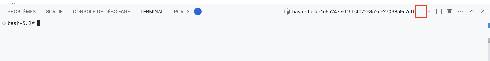
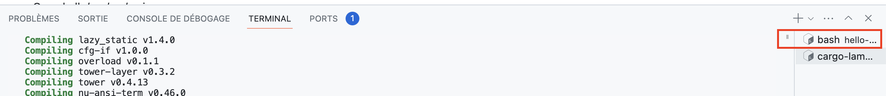

# Step 1: Create your first Lambda Function
## Generate a new lambda function:
```bash
cargo lambda new --template https://github.com/maxday/rust-workshop --no-interactive hello-${CLOUDENV_ENVIRONMENT_ID}
```

## Enter your hello function directory
```bash
cd hello-${CLOUDENV_ENVIRONMENT_ID}
```

## Open the main file

Open hello/xxx/src/main.rs

## Run a local server to run our Lambda function

Open a new terminal clicking the '+'



Run cargo lambda watch
```bash
cd hello-${CLOUDENV_ENVIRONMENT_ID} && cargo lambda watch
```

## Invoke your function locally
Go back to the first terminal



and run
```bash 
cargo lambda invoke --data-ascii '{ "message": "Hello from workshop!" }'
```

## Check the logs
Go back to the second terminal and you should see logs

## Add a new log 
In `main.rs`
Let's add a new log
```rust
tracing::info!("this is a new log");
``````
Invoke your function again
```bash 
cargo lambda invoke --data-ascii '{ "message": "Hello from workshop!" }'
```
And go to the second terminal to see the new log!


# Step 2: Modify our function to accept a pizza
In `main.rs`, create a new struct
```rust
struct Pizza {
    name: String,
    toppings: Vec<String>,
}
```

Add some useful `derive` insctruction
```rust
#[derive(Serialize, Deserialize, Debug)]
struct Pizza {
    name: String,
    toppings: Vec<String>,
}
```

Add the corresponding import on the top of the file
```rust
use serde::Deserialize;
```

Finally, change the signature of the `func` from Value to Pizza
```rust
async fn func(event: LambdaEvent<Pizza>) -> Result<Response, Error> {
```

You can now safely remove the used import
```rust
use serde_json::Value;
```

Try invoking 
```bash
cargo lambda invoke --data-ascii '{ "message": "Hello from workshop!" }'
```

You should have an error!

Try invoking by passing a valid pizza struct!
```bash
cargo lambda invoke --data-ascii '{ "name": "Veggie", "toppings" : ["green peppers", "onion", "tomatoes"] }'
```

Let's modify our function to return the number of topping instead of the full pizza.
Change the return statement to
```rust
Ok(Response {
    message: serde_json::to_string(&event.payload.toppings.len())?.to_string(),
})
```

And invoke your function again
```bash
cargo lambda invoke --data-ascii '{ "name": "Veggie", "toppings" : ["green peppers", "onion", "tomatoes"] }'
```
You should receive: `{"message":"3"}`

Try adding or removing toppings to see how it changes the result

# Step 3: Deploy our function 
## First let's build our function
```bash
cargo lambda build
```

## Authenticate with AWS
```bash
/root/auth.sh <SECRET>
```

## Deploy!
This will deploy your function to a real AWS account
```bash
cargo lambda deploy --iam-role $DEPLOY_ROLE_ARN
```

## Invoke your function
Note the `remote` argument
```bash
cargo lambda invoke --remote hello-${CLOUDENV_ENVIRONMENT_ID} --data-ascii '{ "name": "Veggie", "toppings" : ["green peppers", "onion", "tomatoes"] }'
```

Congrats! You've just deployed and invoked your first Lambda function!

# Step 4: Add Unit testing

How to make sure that the logic is valid?
Let's refactor our code

## Create a count topping function

Add this below the `Pizza` struct
```rust
impl Pizza {
    fn count_toppings(&self) -> usize {
        self.toppings.len()
    }
}
```
This will allow us to call `count_toppings` on any pizza!

## Refactor the handler to use this function

Our new handler function will look like this:

```rust
async fn func(event: LambdaEvent<Pizza>) -> Result<Response, Error> {
    tracing::info!("event: {:?}", event.payload);
    Ok(Response {
        message: serde_json::to_string(&event.payload.count_toppings())?.to_string(),
    })
}
```

Make sure we havn't broken anything by invoking again your function locally

```bash
cargo lambda invoke --data-ascii '{ "name": "Veggie", "toppings" : ["green peppers", "onion", "tomatoes"] }'
```


## Add our first unit test

In Rust, logic and unit tests are located on the same file.
At the bottom of `main'rs`, let's add our first test

```rust
#[cfg(test)]
mod tests {

    use super::*;

    #[test]
    fn test_count_toppings() {
        let pizza = Pizza {
            name: "test".to_string(),
            toppings: vec!["cheese".to_string(), "pepperoni".to_string()],
        };
        assert_eq!(pizza.toppings.len(), 2);
    }
}
```

## Run the test
```bash
cargo test
```

The test should pass.
Try to make it fail!

## Add a new test for 0 toppings
```rust
#[test]
fn test_count_no_toppings() {
    let pizza = Pizza {
        name: "test".to_string(),
        toppings: vec![],
    };
    assert_eq!(pizza.toppings.len(), 0);
}
```

Re-run the tests
```rust
cargo test
```

## Add a test for the handler function
This test a bit more complex.
- It uses `async` as we're dealing with asynchronous code
- We then create a default context (since it's fed by AWS, we don't need it)
- Finally, we check that our handler has been successfully executed and that our message is 2 (number of toppings)

```rust
#[tokio::test]
async fn test_func() {
    let payload = Pizza {
        name: "test".to_string(),
        toppings: vec!["cheese".to_string(), "pepperoni".to_string()],
    };
    let context = lambda_runtime::Context::default();
    let le = LambdaEvent::new(payload, context);
    let result = func(le).await;
    assert!(result.is_ok());
    assert!(result.unwrap().message == "2");
}
```

Re-run the tests
```bash
cargo test
```

# Step 5: Run code coverage

Test coverage allows you to know which portion of the code is covered.
It creates a report highlighing each line:
- in green: what is covered
- in red: what is not covered

Run it with:
```
CARGO_INCREMENTAL=0 RUSTFLAGS='-Cinstrument-coverage' LLVM_PROFILE_FILE='target/cargo-test-%p-%m.profraw' cargo test --bins
grcov . -s src \
--binary-path ./target/debug/ -t html \
--branch --ignore-not-existing -o ./target/debug/coverage/
```

Finally go to `target/debug/coverage/main.rs.html`
Right click and select `Download`
